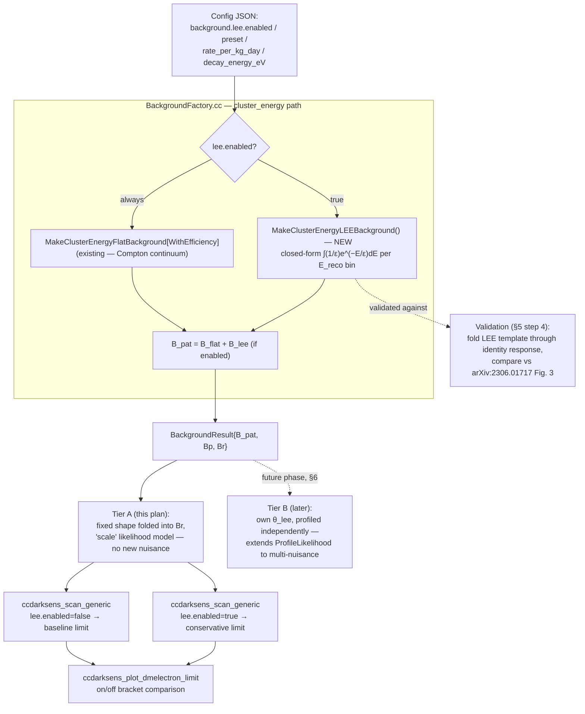

# Low-Energy Excess (LEE) — Design & Implementation Plan
## A new background component for the WIMP-nucleon (nuclear recoil) channel

**Document:** `docs/LowEnergyExcess_Design.md`
**Author:** Diego Venegas-Vargas (drafted with Claude)
**Status:** Tier A (§5) is implemented — `MakeClusterEnergyLEEBackground`, the `backgrounds.lee.*` config schema, and the `MakeBackground` wiring all exist and build cleanly. Smoke-tested against `configs/wimp_nucleon_damic2016_limit_repro.json` via `ccdarksens_validate_response_factory`: with `lee.enabled` off, the low bins are populated only by the small flat-Compton term (`9.9e-4` .. `0.20`); with it on (`damic_snolab_2023_skipper` preset), the same bins are dominated by the LEE term and fall off with bin index as expected for an exponential (`2.58` .. `0.47`). Steps 4 (Fig. 3 reproduction check) and 5 (on/off production scan comparison) from §5 are not done yet. Tier B (§6) remains future work.

---

## 0. Scope

This plan adds a background component to the **WIMP-nucleon SI scattering channel** (`ClusterFitMC`, `cluster_energy` analysis space) — **not** the DM-electron / n_e-space channel. That scoping was itself a correction made during planning (see §8.1) — worth flagging explicitly since it's easy to mis-assign at a glance.

It does **not** touch:
- `EfficiencyMC` / pattern-space / n_e-space machinery (DM-electron, dark photon, Migdal channels)
- `ClusterMC` (deleted backend) or `ClusterFitMC`'s existing reconstruction/calibration logic (`ccdarksens_calibrate_noise_tail`, `ccdarksens_build_cluster_fit_kernel`) — those solve a different problem (per-event ΔLL against pure electronic noise), not the population-level spectral excess this doc addresses.

---

## 1. What the LEE is (physics summary)

DAMIC at SNOLAB (nuclear-recoil / WIMP search, standard non-skipper CCDs, then confirmed with a skipper-CCD upgrade) reported a statistically significant population of low-energy ionization events in the CCD bulk, above the known background model (radioactive backgrounds + flat Compton continuum), with no confirmed physical origin. It is modeled as a flat background plus an **exponentially decaying spectrum**, fit independently twice:

| Analysis | Paper | Exposure | Threshold | Excess rate (events / kg·day) | Decay energy ε | Significance |
|---|---|---|---|---|---|---|
| 2020 PRL, conventional CCDs | [arXiv:2007.15622](https://arxiv.org/abs/2007.15622) (PRL 125, 241803) | 11 kg-day | 50 eVee | 5.1 ± 2.3 | 67 ± 37 eVee | 3.7σ |
| 2023 skipper-CCD confirmation | [arXiv:2306.01717](https://arxiv.org/abs/2306.01717) (FERMILAB-PUB-23-256-PPD) | 3.25 kg-day (fiducial) | 23 eVee | 10.0 +4.0/−3.4 | 89 +36/−24 eVee | 3.4σ |

The two fits are statistically compatible (Fig. 4 of the 2023 paper overlays the allowed (rate, ε) contours) and are treated in the literature as confirming a common origin. Both papers explicitly rule out white readout noise, shot noise from leakage current, and known surface-leakage populations as explanations; the 2023 paper's discussion section walks through and largely excludes conventional radioactive/instrumental explanations, leaving the origin genuinely open. One tentative "exotic" reading: taken at face value as WIMP-nucleus scattering, the excess corresponds to m_χ ≈ 2.5 GeV/c², σ ≈ 3×10⁻⁴⁰ cm² — but that point is already excluded by CDMSlite and DarkSide-50, so it is presented as a curiosity, not a claim.

**Functional form:** the fit is an *unbinned* likelihood over `dN/dE ∝ (1/ε)·exp(−E/ε)` (normalized to unit integral) plus a flat component and, in the 2023 fit, a separately-constrained surface-leakage term (spectrum tied to the fiducial sample, not independently free) — plus the detector's own selection efficiency, since the spectra shown in both papers' figures are corrected for the bulk-event selection efficiency before display.

**Applicability caveat (important — flagged for §8):** the quoted rates are per kg·day *of DAMIC's own detector*. The physical origin is unconfirmed, so there is no first-principles way to scale this to a different target material or geometry (e.g. this codebase's SrCd₂Sb₂ configs) — using it there is model borrowing, not physics.

---

## 2. Where this fits in the existing architecture

The `cluster_energy` background path already exists and is the natural home for this. Current flow (`src/response/BackgroundFactory.cc`):

- `MakeClusterEnergyFlatBackground(fold, exposure_kg_year, Emin_eV, Emax_eV, nbins, flat_rate_dru)` — flat Compton spectrum folded through the signal kernel.
- `MakeClusterEnergyFlatBackgroundWithEfficiency(fold, exposure_kg_year, flat_rate_dru, eff_table)` — same flat spectrum, but evaluated directly per `fold.ErecoEdgesEV()` bin against the background's *own* detection-efficiency curve (digitized from PhysRevD.94.082006 Fig. 9, already in `data/wimp_nucleon_damic2016_fig9_background_1x100.csv`), matching the paper's stated construction (Sec. IV.3).

Both return a `BackgroundResult{B_pat, Bp, Br}` that gets summed into whatever `ProfileLikelihood` consumes. The LEE component would be a **third**, additive contribution computed the same way as the second bullet — directly in E_reco (eV) space, evaluated per bin via `fold.ErecoEdgesEV()`. No new abstractions needed; this is a new leaf function plus one call-site change.

`ProfileLikelihood` already supports a profiled nuisance (`Bp + theta·Br`, `include/ccdarksens/stats/ProfileLikelihood.hh:34-45`) for the *existing* single background component — relevant for Tier B below, not Tier A.

### 2.1 Implementation flow diagram



Solid arrows are the Tier-A path this plan implements; the dashed arrow into `TIERB` is the deferred future phase (§6), shown only for context.

---

## 3. Proposed parameterization

Per E_reco bin `[E_lo, E_hi]`, with total rate `R` (events/kg·day) and decay energy `ε`:

```
N_bin = R · exposure_kg_year · 365.25 · [exp(−E_lo/ε) − exp(−E_hi/ε)]
```

(exact analytic integral of the normalized exponential over the bin — no numerical integration needed, unlike the efficiency-table case which needed Simpson's rule because that curve isn't a closed form). If a detection-efficiency correction is wanted (mirroring `...WithEfficiency`), multiply the per-bin integral by the bin-averaged efficiency the same way that function already does.

Two named presets, taken directly from §1's table, so the exact published numbers are used rather than retyped per config:

- `"damic_snolab_2020"` — R = 5.1 events/kg·day, ε = 67 eVee
- `"damic_snolab_2023_skipper"` — R = 10.0 events/kg·day, ε = 89 eVee

Uncertainties (±2.3, ±37 and +4.0/−3.4, +36/−24 respectively) are recorded in the preset for future error-band work but not used in Tier A (a single central-value on/off bracket).

---

## 4. Config schema (as implemented)

Lives under the existing top-level `"backgrounds"` block (`BackgroundJSON` in `ConfigManager.hh`, same struct that already holds `flat_background`), as a new `"lee"` sub-block:

```json
"backgrounds": {
  "lee": {
    "enabled": false,
    "preset": "damic_snolab_2023_skipper",
    "rate_per_kg_day": 10.0,
    "decay_energy_eV": 89.0
  }
}
```

`preset` fills `rate_per_kg_day`/`decay_energy_eV` from §3's table when set (`damic_snolab_2020` or `damic_snolab_2023_skipper`, default); explicit `rate_per_kg_day`/`decay_energy_eV` override the preset (so a user can also try off-preset values without editing code). `enabled: false` (i.e. the block simply absent) by default — this is an optional, opt-in component, consistent with `include_dc_pileup` being a diagnostic-only flag per `CLAUDE.md`. No `use_background_efficiency` toggle was added — see §7.2's resolution.

---

## 5. Implementation plan — Tier A (fixed-shape background, recommended first slice)

1. **`MakeClusterEnergyLEEBackground(fold, exposure_kg_year, rate_per_kg_day, epsilon_eV)`** in `BackgroundFactory.{hh,cc}` — same signature style as `MakeClusterEnergyFlatBackground`, implementing §3's closed-form per-bin integral.
2. **Config plumbing**: add the `background.lee.*` fields to `ConfigManager` (JSON struct + accessor), including the two named presets resolved at load time.
3. **Wire into `MakeBackground`**: when `cfg.backgrounds().lee.enabled`, add the LEE contribution into the `cluster_energy` background sum alongside the existing flat term (additive, same pattern as the `b_dc + b_flat` sum already in `MakeDcFlatMigrationBackground`).
4. **Validation**: extend or add a small check reproducing Fig. 3 of the 2023 paper (arXiv:2306.01717) — fold the LEE template through a trivial/identity response and confirm the resulting counts/bin match the paper's plotted spectrum, before it's ever used in a projection. Natural home: alongside `ccdarksens_validate_wimp_nucleon_paper_repro`, or a new small validation app if that one's scope shouldn't grow.
5. **Usage**: run `ccdarksens_scan_generic` (WIMP-nucleon channel) twice — `lee.enabled: false` (current baseline) vs. `true` (each preset) — to produce the conservative on/off bracket. Compare via `ccdarksens_plot_dmelectron_limit` (or its WIMP-nucleon analog if one exists) and document the delta in this file's own results section once run.

Estimated footprint: ~1 new function + config fields + 1 call-site change + 1 validation check. No changes to `ProfileLikelihood`, `ClusterFitMC`, or any existing production config's default behavior (opt-in flag).

---

## 6. Tier B — profiled nuisance parameter (future phase, not this pass)

Statistically more correct: give the LEE component its own free normalization `theta_lee`, profiled independently in the likelihood rather than asserted as a fixed on/off bracket — analogous to the existing `Bp + theta·Br` treatment, but with **two** independent nuisances instead of one (`Bp + theta_bkg·Br_bkg + theta_lee·Br_lee`). This requires extending `ProfileLikelihood`'s minimizer (both the 1D `MinimizeOverScale`-equivalent and the 2D pydme-style minimizer) to a genuinely multi-nuisance model — a real architectural change, not config plumbing. Deferred until Tier A's on/off bracket shows the effect is large enough to justify the added complexity.

---

## 7. Open questions — resolutions

1. **Config field location** — resolved: `BackgroundJSON` (`ConfigManager.hh`), as flat `has_lee_bkg`/`lee_rate_per_kg_day`/`lee_decay_energy_eV` fields, parsed from a `"lee"` sub-block under the existing top-level `"backgrounds"` key — same pattern as the existing `flat_background` fields, not a new nested config type.
2. **Efficiency correction** — resolved: **not implemented**. Tier A's LEE term is efficiency-free (no `use_background_efficiency` option was added). The published rates are already corrected for bulk-event acceptance in the source papers (2306.01717 Fig. 3's caption: spectra "corrected for the bulk event acceptance"), so applying the background-detection-efficiency table on top would double-correct. Revisit only if a future preset's rate is *not* acceptance-corrected.
3. **Preset default** — resolved: `damic_snolab_2023_skipper` is the default when `preset` is omitted or the `lee` block gives no explicit `rate_per_kg_day`/`decay_energy_eV`.
4. **Applicability to non-silicon targets** — resolved: left as a user judgment call, documented in the field comments in `ConfigManager.cc` and `ConfigManager.hh` (no hard gate). `ErecoEdgesEV()` still throws a clear error if `lee.enabled` is set on a non-`cluster_energy` config, so a channel-scope mistake fails loudly rather than silently.

---

## 8. Appendix

### 8.1 Correction note (for context, not action)

Earlier in this planning conversation the LEE was initially scoped to the DM-electron n_e-space channel; the user correctly flagged that the published DAMIC excess is reported in the WIMP-nucleus (nuclear recoil) search papers, not the electron-recoil ones. Verified via web search and the two source PDFs above. Recorded here so the correction isn't silently lost if this doc is read later without the surrounding conversation.

### 8.2 References

- A. Aguilar-Arevalo et al. (DAMIC), "Results on Low-Mass Weakly Interacting Massive Particles from an 11 kg-day Target Exposure of DAMIC at SNOLAB," PRL 125, 241803 (2020). [arXiv:2007.15622](https://arxiv.org/abs/2007.15622)
- A. Aguilar-Arevalo et al. (DAMIC), "Characterization of the background spectrum in DAMIC at SNOLAB," Phys. Rev. D 105, 062003 (2022). [arXiv:2110.13133](https://arxiv.org/abs/2110.13133)
- A. Aguilar-Arevalo et al. (DAMIC, DAMIC-M, SENSEI Collaborations), "Confirmation of the spectral excess in DAMIC at SNOLAB with skipper CCDs," FERMILAB-PUB-23-256-PPD (2024). [arXiv:2306.01717](https://arxiv.org/abs/2306.01717)
- A. Chavarria (DAMIC Collaboration), "The low-energy spectrum in DAMIC at SNOLAB," proceedings, IDM 2022. [arXiv:2210.00587](https://arxiv.org/abs/2210.00587)
- A. Aguilar-Arevalo et al. (DAMIC), "Search for low-mass WIMPs in a 0.6 kg day exposure of the DAMIC experiment at SNOLAB," Phys. Rev. D 94, 082006 (2016) — the paper `ccdarksens_validate_wimp_nucleon_paper_repro` already reproduces, and the source of `data/wimp_nucleon_damic2016_fig9_background_1x100.csv`.
