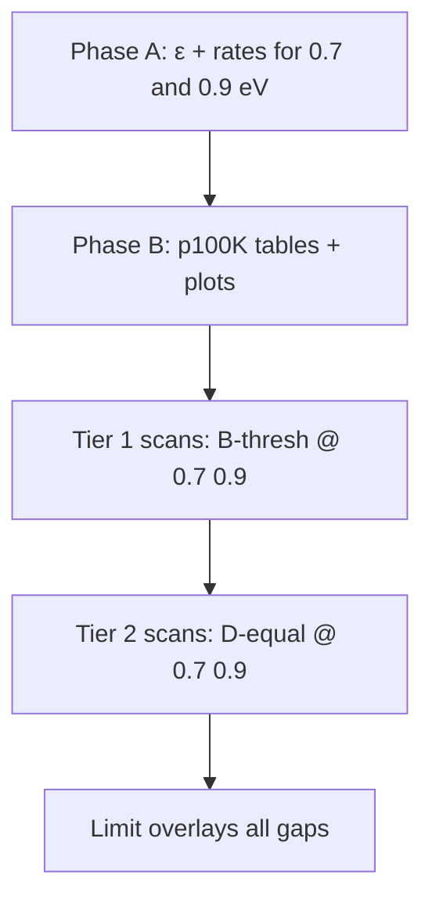

# Band-gap study: roadmap (how to proceed)

> **Prerequisites:** [band_gap_study_architecture.md](band_gap_study_architecture.md), [band_gap_pheno_ionization.md](band_gap_pheno_ionization.md).

This is the **execution plan** after clarifying that:

- **Scissor gap** → QCDark2 ε + rates (one pipeline per gap value).
- **`eh_pair_eV`** → scaled p100K only (several ionization cases can share the same `rates_dir`).

---

## 1. Target gap sweep

| Phase | Scissor gaps [eV] | Status (May 2026) |
|-------|-------------------|-------------------|
| Done (scissor-only scans) | 0.1, 0.3, 0.5, 1.2 | ε + rates + `scan_dmelectron_band_gap_study_*` |
| **New (this plan)** | **0.7, 0.9** | Pending ε + rates + scans |
| Reference | 1.2 | Same as Si ref |

**Full gap grid for limits overlay:**  
`0.1, 0.3, 0.5, 0.7, 0.9, 1.2` eV (six scissor points).

Ionization pheno at each gap (minimum):

- **B-thresh:** `eh = 3.8 eV`
- **D-equal:** `eh = gap` eV  
- Optional: **A-ratio** at selected gaps (e.g. 0.7 → eh ≈ 2.22 eV)

---

## 2. Phase A — QCDark2 dielectric + rates (per new gap only)

Run **once per gap** for **0.7** and **0.9** eV (not per eh).

### A.1 Regenerate ε HDF5

```bash
cd /Users/diegovenegasvargas/Documents/CCDarkSens

python3 utils/qcdark2_regenerate_epsilon.py \
  --template configs/qcdark2/Si_fast_scissor.in \
  --scissor 0.7 0.9 \
  2>&1 | tee data/qcdark2_epsilon/Si/scissor_sweep_0p7_0p9.log
```

**Expected outputs:**

```text
data/qcdark2_epsilon/Si/Si_fast_gap0p7.h5
data/qcdark2_epsilon/Si/Si_fast_gap0p9.h5
```

Reuses DFT under `data/qcdark2_epsilon/Si/DFT_resources/` if settings match prior fast runs.

### A.2 Rate grids

Create or copy JSON configs (from `configs/qcdark2_generate_si_comp_demo.json` or existing grid generator), e.g.:

```text
epsilon_h5: data/qcdark2_epsilon/Si/Si_fast_gap0p7.h5
rates_dir:  data/qcdark2_rates/Si/heavy/Si_fast_gap0p7/
```

Repeat for `gap0p9`.

```bash
# Example pattern (adjust to your grid JSON names):
python3 utils/qcdark2_generate_grid.py configs/qcdark2_generate_Si_heavy_gap0p7.json
python3 utils/qcdark2_generate_grid.py configs/qcdark2_generate_Si_heavy_gap0p9.json
```

*(Add `configs/qcdark2_generate_Si_heavy_gap0p7.json` / `gap0p9.json` when implementing — copy from an existing gap0p3 template.)*

### A.3 Scissor-only scans (optional baseline)

Copy `configs/scan_dmelectron_band_gap_study_0p3.json` →  
`configs/scan_dmelectron_band_gap_study_0p7.json` and `_0p9.json`.

Set:

- `model.rates_dir` → `Si_fast_gap0p7` / `Si_fast_gap0p9`
- `run.outdir` → `outputs/scan_dmelectron_band_gap_study_0p7` / `_0p9`
- **No** `charge_ionization` block → default `p100K_table.csv` (documents scissor-only baseline)

```bash
build/ccdarksens_scan_dmelectron_pattern configs/scan_dmelectron_band_gap_study_0p7.json
build/ccdarksens_scan_dmelectron_pattern configs/scan_dmelectron_band_gap_study_0p9.json
```

### A.4 Step 1 figure — `dR/dE` check

```bash
python3 utils/plot_band_gap_pheno_dRdE.py \
  --mchi-MeV 10 --sigma 1.0e-40 \
  --out outplots/band_gap_pheno/step1_dRdE/dRdE_m10_all_gaps.pdf \
  --curve \
    "gap0p1=data/qcdark2_rates/Si/heavy/Si_fast_gap0p1" \
    "gap0p3=data/qcdark2_rates/Si/heavy/Si_fast_gap0p3" \
    "gap0p5=data/qcdark2_rates/Si/heavy/Si_fast_gap0p5" \
    "gap0p7=data/qcdark2_rates/Si/heavy/Si_fast_gap0p7" \
    "gap0p9=data/qcdark2_rates/Si/heavy/Si_fast_gap0p9" \
    "gap1p2=data/qcdark2_rates/Si/heavy/Si_fast_gap1p2" \
  --Emin 0 --Emax 5
```

---

## 3. Phase B — Ionization tables (per gap × eh rule)

No QCDark2 work. Build CSVs and validation plots.

### B.1 Tables to add for 0.7 and 0.9 eV

| File | gap | eh | Scenario |
|------|-----|-----|----------|
| `data/p100K_gap0p7_eh3p8.csv` | 0.7 | 3.8 | B-thresh |
| `data/p100K_gap0p7_eh0p7.csv` | 0.7 | 0.7 | D-equal |
| `data/p100K_gap0p7_eh2p22.csv` | 0.7 | 2.217 | A-ratio (3.8×0.7/1.2) |
| `data/p100K_gap0p9_eh3p8.csv` | 0.9 | 3.8 | B-thresh |
| `data/p100K_gap0p9_eh0p9.csv` | 0.9 | 0.9 | D-equal |
| `data/p100K_gap0p9_eh2p85.csv` | 0.9 | 2.85 | A-ratio |

```bash
python3 utils/build_p100K_scaled.py --band-gap-eV 0.7 --eh-pair-eV 3.8 --scenario B-thresh
python3 utils/build_p100K_scaled.py --band-gap-eV 0.7 --eh-pair-eV 0.7 --scenario D-equal
# ... etc.

python3 utils/eval_p100K_scaling.py
python3 utils/plot_p100K_scaling_compare.py --Emax-high 50
```

Fan plots: `outplots/band_gap_pheno/step2_p100K/Pne_fan/Pne_fan_*.pdf`

### B.2 Update manifest

Extend `configs/band_gap_pheno_scenarios.json` with 0.7 / 0.9 entries (see updated file in repo).

---

## 4. Phase C — Coupled pheno scans (limits)

Priority order (same exposure / background as existing scans):

### Tier 1 — New gaps, threshold ionization (isolates gap in both layers)

| Scan config (to create) | `rates_dir` | `ionization_csv` |
|-------------------------|-------------|------------------|
| `scan_band_gap_pheno_0p7_eh3p8.json` | `Si_fast_gap0p7` | `p100K_gap0p7_eh3p8.csv` |
| `scan_band_gap_pheno_0p9_eh3p8.json` | `Si_fast_gap0p9` | `p100K_gap0p9_eh3p8.csv` |

### Tier 2 — Same gaps, D-equal (ionization bracket)

| Scan config | `ionization_csv` |
|-------------|------------------|
| `scan_band_gap_pheno_0p7_eh0p7.json` | `p100K_gap0p7_eh0p7.csv` |
| `scan_band_gap_pheno_0p9_eh0p9.json` | `p100K_gap0p9_eh0p9.csv` |

### Tier 3 — Fill in 0.1 / 0.3 pheno (if not done)

Existing configs: `scan_band_gap_pheno_0p1_eh0p1.json`, `_0p1_eh3p8.json`, `_0p3_*`.

```bash
build/ccdarksens_scan_dmelectron_pattern configs/scan_band_gap_pheno_0p7_eh3p8.json
# ... long runs: 80×30 grid × PatternMC
```

### Tier 4 — Limit overlays

```bash
build/ccdarksens_plot_dmelectron_limit \
  outputs/scan_band_gap_pheno_0p7_eh3p8/scan_dmelectron_pattern.root "0.7 B-thresh" \
  outputs/scan_band_gap_pheno_0p9_eh3p8/scan_dmelectron_pattern.root "0.9 B-thresh" \
  outputs/scan_dmelectron_band_gap_study_1p2/scan_dmelectron_pattern.root "1.2 ref" \
  heavy --from-qhist --batch \
  --title "Band-gap sweep (B-thresh ionization)" \
  --out-pdf outplots/band_gap_pheno/step5_limits/limit_gap_sweep_B-thresh.pdf \
  --out-csv outplots/band_gap_pheno/step5_limits/limit_gap_sweep_B-thresh.csv
```

Repeat for D-equal subset to compare ionization brackets at 0.7 / 0.9 eV.

---

## 5. Suggested timeline



| Step | Effort | Blocks |
|------|--------|--------|
| A.1 ε for 0.7, 0.9 | Hours (reuse DFT) | B, C |
| A.2 rate grids | CPU / wall time | C |
| B ionization CSVs | Minutes | C |
| C scans | **Large** (same as prior gap scans) | D |

---

## 6. What we are **not** doing

- Rebuilding ε for every `(gap, eh)` pair.
- Expecting `eh_pair_eV` in QCDark2 JSON to change `dR/dE`.
- Using QCDark2 `recoil_spectrum()` in CCDarkSens (we use `ChargeIonization` + scaled CSV).

---

## 7. Checklist (copy to issue tracker)

- [ ] ε: `Si_fast_gap0p7.h5`, `Si_fast_gap0p9.h5`
- [ ] Rates: `data/qcdark2_rates/Si/heavy/Si_fast_gap0p7/`, `.../gap0p9/`
- [ ] p100K: B-thresh + D-equal (+ optional A-ratio) for 0.7, 0.9
- [ ] Manifest + scan JSONs for pheno 0.7 / 0.9
- [ ] Scissor-only scans `scan_dmelectron_band_gap_study_0p7`, `_0p9` (optional)
- [ ] Pheno scans + limit PDFs for full gap sweep
- [ ] Update `band_gap_pheno_ionization.md` checklist to match completed tools

---

## 8. Quick reference: one gap end-to-end (0.7 eV example)

```bash
# 1. Dielectric
python3 utils/qcdark2_regenerate_epsilon.py \
  --template configs/qcdark2/Si_fast_scissor.in --scissor 0.7

# 2. Rates (after grid JSON exists)
# python3 utils/qcdark2_generate_grid.py configs/...

# 3. Ionization
python3 utils/build_p100K_scaled.py --band-gap-eV 0.7 --eh-pair-eV 3.8 --scenario B-thresh
python3 utils/build_p100K_scaled.py --band-gap-eV 0.7 --eh-pair-eV 0.7 --scenario D-equal

# 4. Scan (after scan JSON exists)
# build/ccdarksens_scan_dmelectron_pattern configs/scan_band_gap_pheno_0p7_eh3p8.json
```
