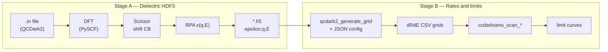

# QCDark2 dielectric functions for CCDarkSens — full workflow

> **Architecture (gap vs eh, what QCDark2 actually uses):** [band_gap_study_architecture.md](band_gap_study_architecture.md)  
> **Execution plan (0.7 & 0.9 eV, coupled pheno):** [band_gap_study_roadmap.md](band_gap_study_roadmap.md)

This document explains how Si dielectric HDF5 files are produced, what each input means (including **8×8×8**), how that connects to DM rate tables and limits, and which configuration to use when.

---

## 1. What problem are we solving?

CCDarkSens computes dark-matter electron scattering rates using a crystal **dielectric function** ε(ω, **q**):

- **ω** (or **E**) = energy transfer to the crystal (eV)  
- **q** = momentum transfer (stored in the HDF5; used internally as q × α×mₑ to get eV)

The rate integral needs ε on a grid of (q, E). That grid is **not** adjustable at rate-generation time in `ccdarkphys/qcdark2/entry.py` — it comes from a precomputed HDF5 file (e.g. `Si_comp.h5` or your regenerated `Si_fast_gap0p3.h5`).

The **band gap** is encoded in the **electronic structure** used to build ε. In QCDark2 the practical knob is:

```text
scissor_bandgap = <target gap in eV>
```

After DFT, all **conduction** band energies are shifted uniformly so the fundamental gap equals this value. Then ε(ω, q) is computed in the RPA (random-phase approximation).

---

## 2. End-to-end pipeline (two stages)



| Stage | Tool | Input | Output |
|--------|------|--------|--------|
| **A** | `utils/qcdark2_regenerate_epsilon.py` or `python -m qcdark2.dielectric_pyscf` | `configs/qcdark2/*.in` | `data/qcdark2_epsilon/Si/*.h5` |
| **B** | `utils/qcdark2_generate_grid.py` + CCDarkSens apps | JSON + `epsilon_h5` path | `data/qcdark2_rates/.../*.csv` → limits |

Stage A is what you are running now for gaps **0.1, 0.3, 0.5 eV**. Stage B is unchanged except you point `epsilon_h5` at each new `.h5`.

---

## 3. Stage A in detail — what QCDark2 does step by step

### Step 0 — Read the `.in` file

Example: `configs/qcdark2/Si_fast_scissor.in`. Key lines:

| Parameter | Meaning |
|-----------|---------|
| `save_path` | Directory for all outputs (DFT cache + per-run folders) |
| `name` | Run label; outputs go to `<name>_resources/` |
| `lattice_vectors`, `atom`, `basis` | Silicon crystal structure and Gaussian basis (e.g. `cc-pv(t+d)z`) |
| `xcfunc` | DFT exchange–correlation (e.g. `pbe`) |
| `k_grid` | Monkhorst–Pack sampling (see §4) |
| `scissor_bandgap` | Target band gap (eV) after scissor correction |
| `include_lfe` | Local field effects in RPA (slower, needed for low q in production) |
| `q_max`, `dq` | Momentum binning range and step (inverse Bohr in the calculator) |
| `E_max`, `dE` | Energy grid for ε (eV) |
| `q_shift` | Shift of final-state k-mesh (optional; production templates set this explicitly) |

### Step 1 — Build the crystal (PySCF)

QCDark2 builds a periodic unit cell, G-vectors, atomic orbitals, etc.

### Step 2 — DFT (cached)

- **SCF** on the initial k-mesh → occupied/virtual MOs, energies, coefficients.  
- **NSCF** on a shifted k-mesh (unless `q_shift = [0,0,0]`) for finite-momentum transitions.

Results are stored under:

```text
<save_path>/DFT_resources/DFT_<n>/
```

If a later run uses the **same** lattice, atom, basis, `xcfunc`, `k_grid`, and `q_shift`, QCDark2 **reuses** this DFT and skips Step 2. Changing only `scissor_bandgap` or `name` does **not** require new DFT.

### Step 3 — Scissor correction

- Convert MO energies to eV; set valence band top to 0.  
- Measure DFT gap (LUMO − HOMO).  
- Shift **all conduction bands** by `(scissor_bandgap − DFT_gap)`.

So `scissor_bandgap = 0.3` means ε is built as if the crystal had a **0.3 eV** gap, regardless of the raw PBE gap (~0.6–1.1 eV depending on k-density).

### Step 4 — RPA dielectric function

For each crystal momentum **q** in the Brillouin zone (from the k-grid construction):

1. Form transitions between initial/final MOs (valence → conduction).  
2. Build the RPA response; optionally include **local field effects (LFE)**.  
3. Bin |q| and solid angle; Kramers–Kronig relates Im ε to Re ε.  
4. Angular average → ε(|q|, E).

Written to:

```text
<save_path>/<name>_resources/epsilon.hdf5
```

Datasets: `epsilon` (complex), `q`, `E`. Attributes: `M_cell`, `V_cell`, `dE`.

### Step 5 — Package for CCDarkSens

`utils/qcdark2_regenerate_epsilon.py` copies the essentials into a slim file, e.g.:

```text
data/qcdark2_epsilon/Si/Si_fast_gap0p3.h5
```

Optional attr: `scissor_bandgap_eV`.

---

## 4. What does **8×8×8** mean?

`k_grid = [8, 8, 8]` is the **Monkhorst–Pack k-point mesh**:

- The Brillouin zone (crystal momentum space) is sampled on an **8 × 8 × 8** uniform grid.  
- That is **8³ = 512 k-points** per mesh (per SCF/NSCF stage).  
- DFT sums over these points to approximate integrals over the zone.

**Why it matters**

| k-grid | k-points | Typical use |
|--------|----------|-------------|
| `[4,4,4]` | 64 | Fast tests / interim scissor scans |
| `[8,8,8]` | 512 | **Shipped `Si_comp.h5` LFE segment** |
| `[10,10,10]` | 1000 | Heavier materials (e.g. Ge in QCDark2 examples) |

A coarser grid (4×4×4) gives faster DFT and ε but rougher band structure and ε(ω, q). Limits from 4×4×4 + scissor are useful for **relative** gap studies; **publication-grade limits comparable to `Si_comp.h5`** need the production templates (`Si_lfe8q.in`, `Si_nolfe25q.in`) with **8×8×8** (and composite merge).

**Not** the same as:

- `q_max = 8` — maximum **momentum transfer** in the dielectric binning (related to DM kinematics, not k-point count).  
- `dE = 0.1` — energy bin width (eV) in the output table.

---

## 5. What is `Si_comp.h5`?

The file in QCDark2:

`.../QCDark2/dielectric_functions/composite/Si_comp.h5`

Naming (from QCDark2 README):  
`Si_cc-pv(t+d)z_pbe_8k_8qlfe_25qnolfe_qs0.066286`

| Piece | Meaning |
|--------|---------|
| `8k` | 8×8×8 k-grid |
| `8qlfe` | LFE included up to q ≲ 8 |
| `25qnolfe` | without LFE from higher q up to ~25 |
| `qs0.066286` | q-shift vector for the LFE segment |

So “limits comparable to `Si_comp.h5`” later means: run **`Si_lfe8q.in`** and **`Si_nolfe25q.in`** (or the upstream composite workflow), merge q-ranges if needed, then use that HDF5 in your rate grid.

---

## 6. Configurations in this repo

| File | Purpose | k-grid | LFE | q_max | Gap scan? |
|------|---------|--------|-----|-------|-----------|
| `Si_smoke.in` | Pipeline test (stopped) | 4×4×4 | no | 1 | no (1.2 eV) |
| **`Si_fast_scissor.in`** | **Current: 0.1, 0.3, 0.5 eV** | 4×4×4 | no | 2 | yes |
| `Si_lfe8q.in` | Production low-q (later) | 8×8×8 | yes | 8 | yes |
| `Si_nolfe25q.in` | Production high-q (later) | 8×8×8 | no | 25 | yes |

---

## 7. Commands you are using now

**Stop smoke test** (already done if no process listed):

```bash
pkill -f "Si_smoke.in"
```

**Scissor sweep 0.1, 0.3, 0.5 eV** (reuses DFT under `data/qcdark2_epsilon/Si/DFT_resources/` if compatible):

```bash
cd /Users/diegovenegasvargas/Documents/CCDarkSens

/Users/diegovenegasvargas/Documents/Software/QCDark2/.venv/bin/python3 \
  utils/qcdark2_regenerate_epsilon.py \
  --template configs/qcdark2/Si_fast_scissor.in \
  --scissor 0.1 0.3 0.5 \
  2>&1 | tee data/qcdark2_epsilon/Si/scissor_sweep_0p1_0p3_0p5.log
```

**Expected outputs**

```text
data/qcdark2_epsilon/Si/Si_fast_gap0p1.h5
data/qcdark2_epsilon/Si/Si_fast_gap0p3.h5
data/qcdark2_epsilon/Si/Si_fast_gap0p5.h5
```

**Monitor progress**

```bash
tail -f data/qcdark2_epsilon/Si/scissor_sweep_0p1_0p3_0p5.log
# or per-run:
tail -f data/qcdark2_epsilon/Si/Si_fast_gap0p1_resources/Si_fast_gap0p1_eps.log
```

---

## 8. Stage B — from HDF5 to limits (after ε files exist)

1. Copy or symlink the `.h5` path into a rate-grid JSON, e.g.:

   ```json
   "backend": "qcdark2",
   "epsilon_h5": "data/qcdark2_epsilon/Si/Si_fast_gap0p3.h5",
   "detector": { "band_gap_eV": 0.3, "binsize_eV": 0.1, ... }
   ```

   Note: `detector.band_gap_eV` in JSON does **not** change QCDark2 physics; the gap is in the HDF5 via scissor. Set it to the same value for bookkeeping.

2. Generate rates:

   ```bash
   python3 utils/qcdark2_generate_grid.py configs/your_qcdark2_grid.json
   ```

3. Run your usual CCDarkSens scan/limit apps on those CSVs.

Repeat Stage B for each of the three `.h5` files to compare limits vs gap.

---

## 9. Later: production match to `Si_comp.h5`

For each target gap (e.g. 0.3 eV):

```bash
python3 utils/qcdark2_regenerate_epsilon.py \
  --template configs/qcdark2/Si_lfe8q.in --scissor 0.3

python3 utils/qcdark2_regenerate_epsilon.py \
  --template configs/qcdark2/Si_nolfe25q.in --scissor 0.3
```

Then splice LFE (q ≤ 8) + no-LFE (q > 8) into one composite HDF5 (manual or script — not yet in repo). Use that composite in `epsilon_h5` for final limits.

---

## 10. File tree reference

```text
CCDarkSens/
  configs/qcdark2/
    Si_fast_scissor.in      # interim gap scan
    Si_lfe8q.in             # production segment 1
    Si_nolfe25q.in          # production segment 2
  utils/
    qcdark2_regenerate_epsilon.py
    qcdark2_generate_grid.py
  data/qcdark2_epsilon/Si/
    DFT_resources/          # shared DFT cache
    Si_fast_gap0p1_resources/
    Si_fast_gap0p1.h5
    ...
  python/ccdarkphys/qcdark2/entry.py   # reads .h5 → dR/dE

Software/QCDark2/                     # upstream package
  .venv/bin/python3 -m qcdark2.dielectric_pyscf ...
  dielectric_functions/composite/Si_comp.h5
```

---

## 11. Dependencies

QCDark2 venv (`/Users/diegovenegasvargas/Documents/Software/QCDark2/.venv`):

- `pyscf`, `qcdark2`, `h5py`, `numpy`, …  
- **`basis-set-exchange`** (required for `cc-pv(t+d)z`):

  ```bash
  .venv/bin/pip install basis-set-exchange
  ```

---

## 12. FAQ

**Q: Can I change the gap without rerunning DFT?**  
A: Yes — same `save_path`, same crystal/DFT settings, different `scissor_bandgap` and `name`. Only ε is recomputed.

**Q: Why three gaps = three HDF5 files?**  
A: Scissor changes the transition energies → different Im/Re ε → different rates. One file = one gap.

**Q: Is 0.1 eV realistic for Si?**  
A: Not as **bulk silicon physics** — see [§13](#13-scissor-correction-vs-dft-does-the-crystal-change). It **is** appropriate as a **phenomenological** effective threshold in the low-gap DM scan ([§14](#14-phenomenological-low-band-gap-dm-study-using-si)).

**Q: Where is band gap in the HDF5?**  
A: Not a separate dataset; it is implied by the scissor used when building `epsilon`. We store `scissor_bandgap_eV` in attrs when packaging via our script.

---

## 13. Scissor correction vs DFT: does the crystal change?

This section records the physics implied by the QCDark2 code path, so low-gap scans are interpreted correctly.

### What the code does (order of operations)

```text
1. DFT on bulk Si (fixed lattice, atoms, basis, k-grid)   ← identical for every scissor value
2. Scissor: uniform shift of ALL conduction-band energies
3. RPA: build ε(ω,q) from MO energies + MO coefficients
```

Implementation (`qcdark2/dielectric_pyscf/dft_routines.py`, `convert_to_eV_and_scissor`):

- HOMO set to 0 eV; DFT gap = LUMO − HOMO is logged.
- `correction = scissor_bandgap - lumo`
- All conduction energies (initial and final k-meshes) are shifted by `correction`.
- **MO coefficients are not modified** — only energies used in RPA transitions.

### What changes vs what does not

| Quantity | Changes when `scissor_bandgap = 0.1` eV? |
|----------|------------------------------------------|
| Lattice vectors, atom positions | **No** |
| DFT Hamiltonian / SCF density (cached DFT) | **No** |
| MO **coefficients** (wavefunctions) | **No** |
| MO **energies** (conduction bands only) | **Yes** — rigid shift |
| ε(ω,q), DM rates, limits | **Yes** — via transition energies |

You are **not** running “DFT at 0.1 eV gap.” You run **DFT of silicon once**, then impose an **effective gap** before ε. The crystal structure does **not** change drastically (or at all).

### Is `scissor_bandgap = 0.1` eV sensible?

| Interpretation | Verdict |
|----------------|---------|
| Bulk Si with a true 0.1 eV band structure | **No** — intrinsic Si is ~1.1–1.2 eV; 0.1 eV would imply doping, defects, another phase, or an analysis threshold |
| Phenomenological knob: “what if the ionization threshold were 0.1 eV?” with Si-like orbitals | **Yes**, with clear labeling (see §14) |
| Match experimental Si gap (~1.1 eV) from underestimated PBE | **Yes** — standard use of scissor (shipped `Si.in` uses `scissor_bandgap = 1.1`) |

**Caveats for large shifts (e.g. PBE gap ~0.6–1 eV → 0.1 eV):**

1. **Rigid shift only** — no change in band dispersion, effective masses, or screening.
2. **Wavefunctions remain Si-like** — not those of a real ultra-low-gap material.
3. **Low-ω response** can change strongly (more phase space above threshold); that reflects the **model spectrum**, not validated sub-gap bulk Si electronics.
4. **`detector.band_gap_eV` in CCDarkSens JSON** does not alter QCDark2 physics; only the HDF5 scissor matters.

### DFT once per crystal, many gaps

For `scissor = 0.1`, `0.3`, `0.5` eV with the same `save_path` and DFT settings:

- Run **DFT once** (cached under `DFT_resources/`).
- Each gap reruns **scissor + ε** only — correct workflow, not separate DFT per gap.

---

## 14. Phenomenological low band-gap DM study using Si

### Science motivation (CCDarkSens)

We want to estimate **how low band-gap materials would perform in DM-electron searches**. A practical first step is a **phenomenological test on Si**:

- **Fixed:** Si lattice, PBE wavefunctions, QCDark2 RPA ε formalism.
- **Scanned:** `scissor_bandgap` = 0.1, 0.3, 0.5 eV (and optionally ~1.1 eV as reference).
- **Question answered:** *If the ionization threshold were lower, how would DM rates and limits change for semiconductor-like Si?*

This is **not** the same as:

> *What is the rate in a real low-gap crystal (Ge, InSb, …) with its own band structure?*

The Si scissor scan answers the **threshold / phase-space** part of the low-gap story; real materials add different band shapes, screening, and Fermi surfaces (Phase 2 below).

**Ionization (planned):** scans still use fixed `data/p100K_table.csv` (Si turn-on ~1.2 eV, \(\varepsilon_h \sim 3.8\) eV), which can zero out sub-1.2 eV signal even when scissor opens `dR/dE` there. See **[band_gap_pheno_ionization.md](band_gap_pheno_ionization.md)** — independent \((E_\mathrm{gap}, \varepsilon_h)\) choices (including **equal-scale**, e.g. 0.1 eV for both), step-by-step procedure with figures under `outplots/band_gap_pheno/`, and `configs/band_gap_pheno_scenarios.json`.

### Why low gap matters for DM-e (reminder)

- More phase space for energy transfer ω ≳ *E*<sub>g</sub>.
- Rates often rise sharply near threshold.
- Analysis thresholds can be closer to the physical gap.

Scissor on Si isolates **“effective gap”** while holding orbital character fixed — useful for a **trend**, not for absolute claims about a specific low-gap compound.

### How to describe results

| Do say | Do not say |
|--------|------------|
| Phenomenological scan of DM-e sensitivity to effective band gap, using bulk Si DFT wavefunctions with scissor-corrected conduction bands | “Performance of 0.1 eV band gap silicon” |
| Trend for how limits move if a semiconductor-like target had gap *E*<sub>g</sub> with otherwise Si-like ε | “Ab initio low-gap Si” without qualification |

**Suggested plots**

1. dR/dE at fixed *m*<sub>χ</sub>, σ for each scissor gap.
2. Limit curve σ<sub>e</sub>(*m*<sub>χ</sub>) for each gap.
3. Ratio σ<sub>limit</sub>(gap) / σ<sub>limit</sub>(reference) vs *m*<sub>χ</sub> (reference e.g. 1.1 eV or `Si_comp`).

### Three-phase program

| Phase | Goal | Configuration |
|-------|------|----------------|
| **1 — Now** | Relative gain from lowering gap on Si-like ε | `Si_fast_scissor.in`, gaps 0.1 / 0.3 / 0.5 eV → `Si_fast_gap*.h5` → rate grids → limits |
| **2 — Next** | Material dependence vs scissor proxy | QCDark2 ε for **Ge**, **GaAs**, etc.; compare to Si scissored to the same experimental gap |
| **3 — Publication** | Si baseline comparable to literature | `Si_lfe8q.in` + `Si_nolfe25q.in` (8×8×8), composite like `Si_comp.h5` |

If Phase 2 disagrees strongly with Phase 1, the scissor scan **understated** material effects; if shapes are similar, the pheno scan was a useful proxy.

---

## 15. Next steps

Checklist aligned with the low-gap pheno program and production `Si_comp` limits.

### Immediate (in progress)

- [ ] **Finish** `scissor_bandgap = 0.1` eV fast run → confirm `data/qcdark2_epsilon/Si/Si_fast_gap0p1.h5` exists and is ≫ 1 KB.
- [ ] **Monitor:** `tail -f data/qcdark2_epsilon/Si/Si_fast_gap0p1_resources/Si_fast_gap0p1_eps.log` until “Calculation done” / packaging message.
- [ ] **Optional reference point:** rerun with `--scissor 1.1` (or use shipped `Si_comp.h5`) for a Si-like reference on the same pipeline.

### Short term — rates and pheno limits (Phase 1)

- [x] Add rate-grid JSON(s) under `configs/` pointing at each packaged HDF5 (band-gap study configs).
- [x] Run `python3 utils/qcdark2_generate_grid.py` per gap; scans in `outputs/scan_dmelectron_band_gap_study_*`.
- [x] Comparison plot: `outputs/band_gap_study_compare.pdf` (scissor-only ionization).
- [ ] **Ionization coupling (see [band_gap_pheno_ionization.md](band_gap_pheno_ionization.md)):** `build_p100K_scaled.py`, `response.charge_ionization.table_csv`, re-run scans and limits.
- [ ] Produce updated comparison plots after ionization tables are wired.
- [ ] Complete scissor sweep for **0.3** and **0.5** eV when time allows (reuse DFT, ~1× ε time each):

  ```bash
  python3 utils/qcdark2_regenerate_epsilon.py \
    --template configs/qcdark2/Si_fast_scissor.in \
    --scissor 0.3 0.5
  ```

### Medium term — validation and real low-gap materials (Phase 2)

- [ ] Compare one pheno point (e.g. 0.3 eV scissor on Si) to **Ge** (or GaAs) using precomputed `dielectric_functions/composite/` in QCDark2 install.
- [ ] Document whether limit ratios from scissor track real low-gap ε or only threshold shifting.
- [ ] Decide which real material(s) warrant full regenerated ε (not only scissor).

### Long term — `Si_comp`-comparable limits (Phase 3)

- [ ] Run production templates `Si_lfe8q.in` and `Si_nolfe25q.in` with 8×8×8 k-grid (hours–days each).
- [ ] Merge LFE (q ≲ 8) + no-LFE (q → 25) into composite HDF5 (manual/script TBD).
- [ ] Regenerate rate grids with composite `epsilon_h5` for paper-style Si limits.
- [ ] Re-run critical pheno gaps (0.1 / 0.3 eV) at 8×8×8 once if interim 4×4×4 ordering is used for decisions but numbers are quoted externally.

### Repo / documentation hygiene

- [x] Workflow doc (this file) includes scissor physics (§13) and pheno program (§14).
- [ ] Add example configs: `configs/qcdark2_rates_Si_fast_gap0p1.json` (and 0p3, 0p5) when rate JSON pattern is fixed.
- [ ] Note in talk/paper methods: fast 4×4×4 = trend; 8×8×8 composite = absolute Si comparison to `Si_comp.h5`.

### Command reference (quick)

```bash
# Package / regenerate ε
python3 utils/qcdark2_regenerate_epsilon.py \
  --template configs/qcdark2/Si_fast_scissor.in --scissor 0.1

# Rates (after HDF5 exists)
python3 utils/qcdark2_generate_grid.py configs/<your_grid>.json
```
