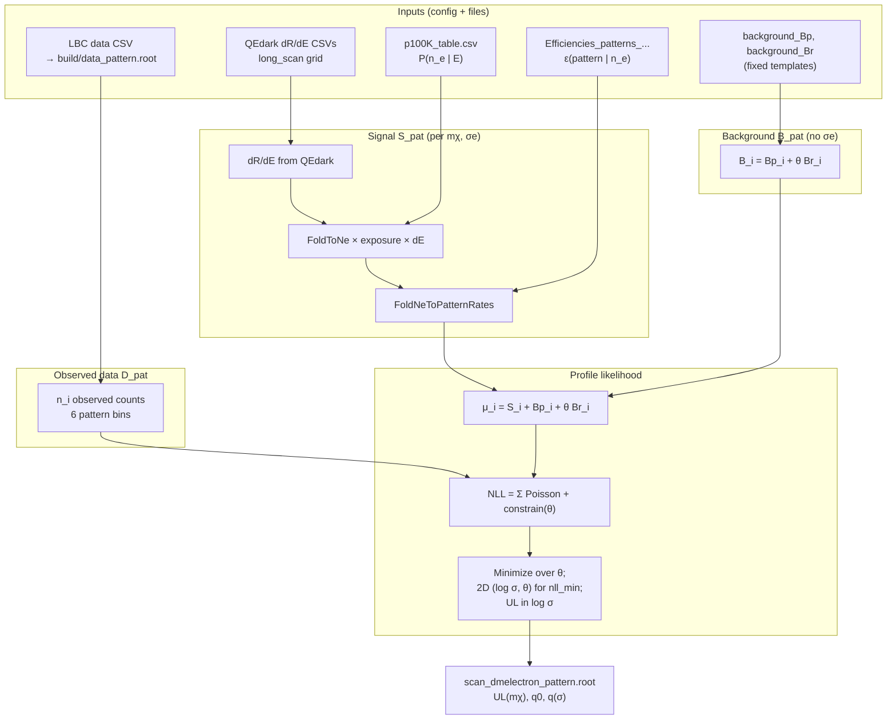
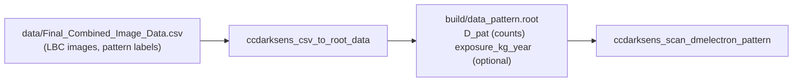
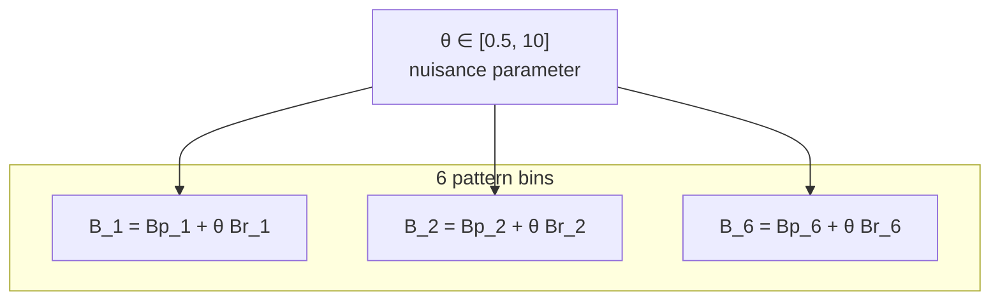
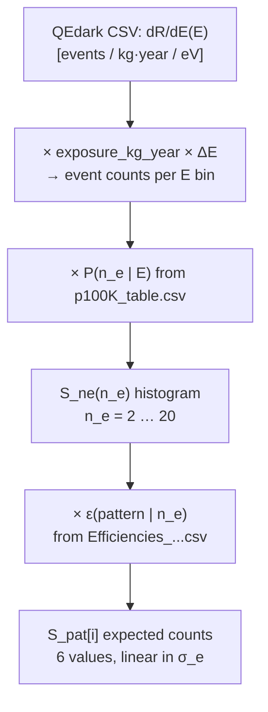
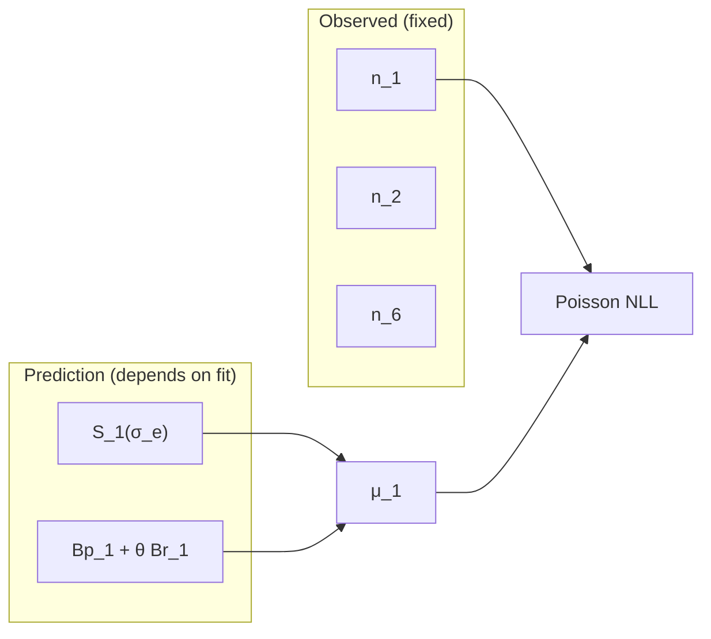
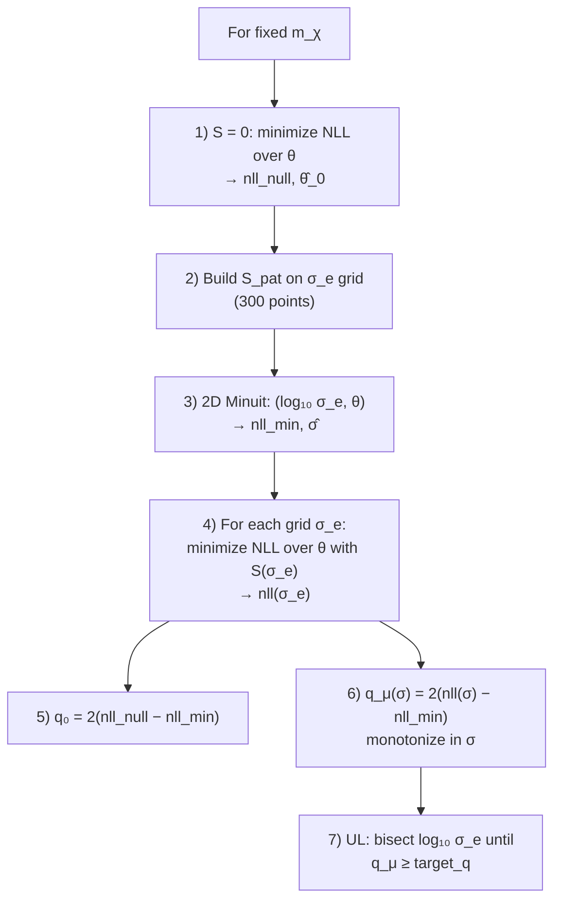
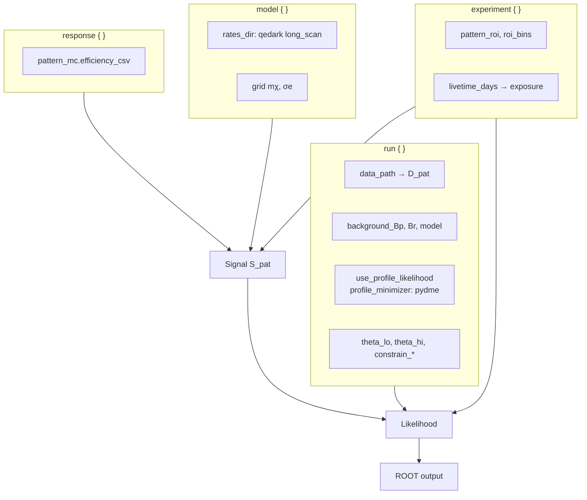

# QEdark pattern data scan — end-to-end flow

Reference config: [`configs/scan_dmelectron_pattern_data_qedark_fullgrid.json`](../configs/scan_dmelectron_pattern_data_qedark_fullgrid.json)  
Binary: `ccdarksens_scan_dmelectron_pattern`  
Output: `outputs/scan_pattern_data_qedark_fullgrid/scan_dmelectron_pattern.root`

This document explains **how observed counts enter the likelihood**, how the **background model** works, how **signal** is built, and how **minimization** produces the 90% CL upper limit on \(\sigma_e\) at each \(m_\chi\). It is written for reproducing the DAMIC-M 2025 pattern-analysis reference curves (`data/previous_limits/heavy_mediator/DAMIC-M_this_work_QEDark_hm.csv`).

**Related docs:** [qedark_repro_next_steps.md](qedark_repro_next_steps.md) (executed matrix + what to run next), [qedark_ul_audit_pydme_srdm.md](qedark_ul_audit_pydme_srdm.md) (SRDM pydme comparison, data fix, UL/contour audit), [Data_units_and_using_real_data.md](Data_units_and_using_real_data.md), [Log_likelihood_pydme_comparison.md](Log_likelihood_pydme_comparison.md), [Profile_likelihood_minimization_flow_pydme.md](Profile_likelihood_minimization_flow_pydme.md), [Pattern_efficiency_pipeline_walkthrough.md](Pattern_efficiency_pipeline_walkthrough.md).

---

## 1. What this scan does (one sentence)

For each dark-matter mass \(m_\chi\) on a dense grid, the code builds **expected signal counts** in six **pattern bins**, compares them to **real observed counts** from LBC under a **pydme-style background** \(B = B_p + \theta B_r\), profiles the nuisance \(\theta\), and finds the **smallest \(\sigma_e\)** such that the profile likelihood ratio reaches the 90% CL threshold.

---

## 2. Big-picture diagram



---

## 3. The six analysis bins (pattern ROI)

Analysis is **not** in raw \(n_e\) space. The observable is **pattern ID** × efficiency fold over \(n_e \in \{2,3,4,5\}\).

| Index \(i\) | `pattern_roi` | Role |
|-------------|---------------|------|
| 0 | 11 | Single-pixel–like |
| 1 | 21 | Two-pixel |
| 2 | 111 | Three-pixel chain |
| 3 | 31 | … |
| 4 | 22 | … |
| 5 | 211 | … |

**Order matters:** `data_path`, `background_Bp`, `background_Br`, and internal vectors all use **the same order** as `experiment.pattern_roi`.

Example from config (templates; **not** used as data when `data_path` is set):

| Pattern | \(B_p\) | \(B_r\) | `observed_counts` (JSON only) |
|---------|---------|---------|-------------------------------|
| 11 | 141.4 | 0.039 | 144 |
| 21 | 0.111 | 0.039 | 0 |
| 111 | 0.042 | 0.016 | 0 |
| 31 | 0.019 | 0.052 | 1 |
| 22 | 2.5×10⁻⁵ | 0.011 | 0 |
| 211 | 5.8×10⁻⁵ | 0.035 | 0 |

Sum of observed in JSON: **145** events in the ROI (dominated by pattern 11).

---

## 4. Observed counts — where they come from

### 4.1 Data file

```json
"data_path": "build/data_pattern.root"
```

At scan time the app loads histogram **`D_pat`** from that ROOT file and **maps bin contents to `pattern_roi` by x-axis label** (pattern id), not by file bin order. See `load_data_root` in `apps/ccdarksens_scan_dmelectron_pattern.cc`.

The input file may contain **more than six bins** (e.g. 11 patterns). Only the six `pattern_roi` ids are used; missing labels get count 0.

**Example (LBC file):** pattern **11 → 144**, pattern **31 → 1**, all other ROI patterns → 0.  
A bug fixed on 2026-06-03 had incorrectly placed the singleton in pattern **22** by taking the first six file bins; see [qedark_ul_audit_pydme_srdm.md §2](qedark_ul_audit_pydme_srdm.md#2-observed-data--bug-fix-pattern-31-vs-22).



**Converter command** (from [Data_units_and_using_real_data.md](Data_units_and_using_real_data.md)):

```bash
./build/ccdarksens_csv_to_root_data \
  data/Final_Combined_Image_Data.csv \
  build/data_pattern.root \
  configs/ccdarksens_scan_dmelectron_pattern.json
```

### 4.2 Units

| Symbol | Meaning | Units |
|--------|---------|--------|
| \(n_i\) / `D_pat[i]` | Observed counts in pattern bin \(i\) | dimensionless counts |
| \(S_i\) | Expected signal counts | counts (for config exposure) |
| \(B_i\) | Expected background counts | counts |

All three must refer to the **same exposure** (kg·year). The scan warns if `exposure_kg_year` in the ROOT file disagrees with config by more than 1%.

### 4.3 Config exposure (used for **signal** normalization)

\[
\text{exposure\_kg\_year} = \frac{\text{livetime\_days} \times \text{duty\_cycle} \times \text{mass\_kg}}{365.25}
\]

For this JSON: `85.356` d × `0.01523` kg → **≈ 3.56×10⁻³ kg·year**.

**Important:** Poisson terms use **observed** \(n_i\) from `D_pat`. **Signal** \(S_i\) is computed with **config** exposure. If those differ, \(\mu_i = S_i + B_i\) is internally inconsistent — fix `livetime_days` / `mass_kg` or regenerate `data_pattern.root` so exposures match.

### 4.4 What is ignored

- `run.observed_counts` in JSON is **not** read when `data_path` is non-empty.
- `experiment.mode: "asimov"` does **not** replace real data when `data_path` is set; it only matters for runs without a data file (then data = background template).

### 4.5 Where in code the data file is used (single answer)

Observed counts are used **only in the profile likelihood** (when `use_profile_likelihood: true`). They are **not** used to build \(S_\mathrm{pat}\) or the fixed \(B_p, B_r\) templates.

```mermaid
sequenceDiagram
  participant CFG as config data_path
  participant LOAD as load_data()
  participant PL as ProfileLikelihood
  participant NLL as NLL(S, θ)

  CFG->>LOAD: build/data_pattern.root
  LOAD->>LOAD: Read TH1D D_pat (6 bins)
  LOAD->>PL: SetData(n_i vector)
  Note over PL: data_ stored; never rescaled

  loop Each mχ, each σe (and each θ minimize)
    PL->>NLL: n_i from data_, μ_i = S_i + Bp_i + θ Br_i
  end

  PL->>PL: Write D_pat copy to output ROOT
```

| Step | File | What happens |
|------|------|----------------|
| **1. Load** | `ccdarksens_scan_dmelectron_pattern.cc` | If `run.data_path` is set, `load_data()` reads ROOT histogram **`D_pat`** (or CSV) into `std::vector<double> data` with length = `pattern_roi.size()` (6). |
| **2. Register** | same, ~lines 1009–1015 | `profile_pl->SetData(data)` stores **`data_`** inside `ProfileLikelihood`. |
| **3. Every fit** | `src/stats/ProfileLikelihood.cc` | `NLL(S, θ)` loops bins: `n_i = data_[i]`, `μ_i = S[i] + Bp[i] + θ·Br[i]`, adds `μ_i - n_i·ln(μ_i)` + constraint(θ). **This is the only place \(n_i\) enters.** |
| **4. Minimization** | scan app, per \(m_\chi\) | `MinimizeOverScaleMinuit(S_pat, θ)` and `MinimizeOverSigmaAndTheta(...)` call `NLL` with the **same** `data_`; only \(S\) and \(\theta\) change. |
| **5. Output** | scan app, end of job | Copies loaded vector to output ROOT as histogram **`D_pat`** (audit trail). |

**Exposure from data file:** `get_exposure_from_data_file()` reads optional `exposure_kg_year` from the same ROOT file and **only prints a warning** if it disagrees with config. It does **not** rescale `data_` or \(S_\mathrm{pat}\).

**If `data_path` is empty:** `SetData(B_pat)` — likelihood uses **expected background** as fake data (Asimov-style), not real observations.

**If `use_profile_likelihood: false`:** a separate branch loads `data_for_q_grid` for PLR `EvaluateNLL` on the \(\sigma\) grid; this config keeps profile mode on, so that branch is inactive.

Minimal code reference (Poisson term):

```cpp
// ProfileLikelihood::NLL — src/stats/ProfileLikelihood.cc
const double n_i = data_[i];           // observed, from D_pat
const double mu  = S[i] + Bp_[i] + param * Br_[i];
nll += mu - n_i * safe_log(mu);
```

---

## 5. Background model

When `background_source` is **`bp_br_template`** (this config), background is **not** folded from dark current + flat spectrum. It is a **fixed pydme/LBC template** with one free scale \(\theta\).

### 5.1 Per-bin expectation

\[
B_i(\theta) = B_{p,i} + \theta\, B_{r,i}
\]

- **\(B_p\)** — “platform” counts per pattern (dominated by pattern 11).
- **\(B_r\)** — “slope” template; \(\theta\) scales shared systematics.
- **Nominal** background: \(\theta = 1\) → \(B = B_p + B_r\).



### 5.2 Constraint (prior on \(\theta\))

With `constrain_prior_strength: 98` and `constrain_use_tau_weighted: true` (current JSON):

\[
\tau = \frac{98}{\sum_i B_{r,i}}
\]

Extra NLL terms (per bin) pull \(\theta\) toward **1** (pydme tau-weighted form). See `ProfileLikelihood::NLL` in `src/stats/ProfileLikelihood.cc`.

| JSON field | Value | Effect |
|------------|-------|--------|
| `constrain_prior_strength` | 98 | Strength of constraint (match pydme) |
| `constrain_use_tau_weighted` | true | Tau-weighted constraint; minimum at \(\theta=1\) |
| `constrain_n_bins` | 1 | Single-bin constraint form (see note below) |
| `theta_lo` / `theta_hi` | 0.5 / 10 | Must **bracket** \(\theta=1\) |

**Note:** Some older runs used `constrain_n_bins: 4450` (LBC image count) and `tau_weighted: false`. That changes the constraint shape. Align with the run that produced your reference CSV before re-scanning.

### 5.3 Alternative background (not used here)

If `background_source` were default, the code would fold **dark current + flat** backgrounds through pattern efficiencies and migration matrices. This config **skips** that path and uses pydme templates only.

---

## 6. Signal model

Signal depends on **\(m_\chi\)** and **\(\sigma_e\)**. It does **not** depend on \(\theta\).

### 6.1 Chain (diagram)



### 6.2 Step details

| Step | Code / file | Notes |
|------|-------------|--------|
| Rates | `DMElectronModel` + `data/qedark_rates/Si/heavy/long_scan/` | Heavy mediator, Si, 2–20 eV |
| Exposure | `ExperimentSetup` | From detector mass + livetime |
| Ionization | `ChargeIonization::FoldToNe` | Default `data/p100K_table.csv` |
| Pattern fold | `FoldNeToPatternRates` | Uses **true** \(n_e\), not cluster-MC reconstruction |
| Efficiencies | `data/Efficiencies_patterns_Nsims1000000_DCTrue_alpha1.csv` | Precomputed MC; `use_2d_image_efficiency: false` |

**Linear scaling:** \(S_i(\sigma_e) \propto \sigma_e\). The scan precomputes \(S_\mathrm{pat}\) on a \(\sigma_e\) grid and interpolates in \(\log_{10}\sigma_e\).

### 6.3 What is deliberately *not* in the signal

- Pattern classifier thresholds affect **efficiency table** only (already in CSV).
- `pattern_mc` simulation is **not** re-run per grid point for signal.
- No second application of readout/diffusion on top of \(\varepsilon(\mathrm{pattern}|n_e)\) (avoids double counting).

---

## 7. Likelihood — how data, signal, and background meet

For each pattern bin \(i = 1\ldots 6\):

\[
\mu_i = S_i(m_\chi, \sigma_e) + B_{p,i} + \theta\, B_{r,i}, \qquad n_i = \text{observed from } D\_\mathrm{pat}
\]

**Poisson contribution:**

\[
-\ln L_\mathrm{Poisson} = \sum_i \left[ \mu_i - n_i \ln \mu_i \right]
\]

**+ constraint** on \(\theta\) (strength 98, tau-weighted in current JSON).



**Data enter only through \(n_i\).** They are never scaled by exposure in the likelihood — exposure mismatch affects **\(S_i\)** only.

---

## 8. Minimization and upper limit (per \(m_\chi\))

`profile_minimizer: "pydme"` with `pydme_style_ul: true`. Grid: 800 masses × 300 \(\sigma_e\) values.

### 8.1 Flowchart



### 8.2 Definitions

| Quantity | Formula | Meaning |
|----------|---------|---------|
| `target_q` | \(\Phi^{-1}(0.9)^2 \approx 1.64\) | 90% CL threshold (`cl: 0.9`) |
| `q0` | \(2(\mathrm{nll\_null} - \mathrm{nll\_min})\) | Significance of signal component |
| `q_μ(σ)` | \(2(\mathrm{nll}(\sigma) - \mathrm{nll\_min})\) | Test statistic vs best fit |
| **UL** | smallest \(\sigma_e\) with \(q_\mu \geq \mathrm{target\_q}\) | Written to `upper_limit_sigma_e_mchi` |

**Minimizer:** ROOT Minuit2 **Simplex** on \(\theta\) (1D) or \((\log_{10}\sigma_e, \theta)\) (2D). Brent fallback if Minuit fails. With `pydme_style_ul`, minima **on** \(\theta\) bounds are kept (common when constraint pushes \(\theta\) to `theta_lo`).

### 8.3 Comparison to pydme (verified against source)

Source checked: `collab_frameworks/pydme/pydme/dme_nLL_exclusion.py` (`nLL_Poisson`, `minimize_nll`, `compute_upper_limit_fast`) and `collab_frameworks/pydme/pydme/detector/background_models/background_pattern.py` (`Background_pattern`).

#### Plain-language summary

You have **6 numbers** (the 6 pattern bins). For each bin you compare **what you saw** (observed counts \(n_i\)) to **what you'd expect** (\(\mu_i = \text{signal} + \text{background}\)). The fit asks: *how big can the signal be before it disagrees with the data?* That largest allowed signal is the **upper limit** on \(\sigma_e\).

The three pieces combine per bin as:

```
μ_i  =  S_i(σe, mχ)   +   Bp_i  +  θ · Br_i
        └─ signal ─┘       └── background ──┘
```

and the score is:

```
NLL = Σ_i [ μ_i − n_i · ln(μ_i) ]   +   constraint(θ)
              └── Poisson ──┘            └─ keeps θ near prior ─┘
```

**Observed counts \(n_i\) enter in exactly one place: the `n_i · ln(μ_i)` term.** They are never rescaled.

#### Method comparison

| Piece | pydme | This config (CCDarkSens) | Match? |
|-------|--------|---------------------------|--------|
| Data | Observed pattern counts (`self.data[i]`) | `D_pat` from ROOT | ✓ |
| Poisson NLL | `Σ (model − data·ln model)` (`nLL_Poisson`) | `Σ [μ_i − n_i·ln μ_i]` | ✓ |
| Background | `B = Bp + θ·Br` (`Background_pattern`) | `B_i = Bp_i + θ·Br_i` | ✓ |
| Bp / Br vectors | `[141.4, 0.111, 0.042, 0.019, 2.5e-5, 5.8e-5]` / `[0.039, 0.039, 0.016, 0.052, 0.011, 0.035]` | Same vectors in JSON | ✓ |
| Best fit | Minuit over **(log₁₀σe, θ) together** → `nll_min` | 2D Minuit2 over **(log₁₀σe, θ)** → `nll_min` | ✓ |
| Background-only (q0) | fix `x0 → 0`, refit θ (`compute_upper_limit_fast`) | fix `S = 0`, profile θ | ✓ |
| Test statistic | `q_μ = 2·(nll(σe) − nll_min)` (`_qmu_at`) | `q_μ = 2·(nll(σe) − nll_min)` | ✓ |
| Threshold | `target_q = Φ⁻¹(0.9)²` (Eq. 56, 1007.1727) | `target_q = NormQuantile(0.9)²` | ✓ |
| Upper limit | **bracket + bisection** in log₁₀σe | **bracket + bisection** in log₁₀σe | ✓ |

**Conclusion on method:** the minimization is equivalent to pydme — profile out θ, scan σe, find where \(q_\mu\) crosses the 90% line. Our code (`MinimizeOverSigmaAndTheta` + per-σ profiling + bisection UL) was written to match pydme step for step.

#### The constraint on θ — one mismatch to fix ⚠️

pydme `Background_pattern` returns, **per bin**:

```python
B = Bp[row] + theta[0]*Br[row]
L = -theta[0]*Br[row] + 98*np.log(theta[0]*Br[row])
```

#### pydme reference: SRDM, not daily modulation

The pydme workflow we compare to is **`collab_frameworks/pydme/analysis/SRDM/upper_limit/lbc_dmanalysis_upperlimits.py`** with **`halo = 'SRDMModulation'`** — not `DailyModulation`. Full comparison table, constraint notes, and contour drawing: [qedark_ul_audit_pydme_srdm.md](qedark_ul_audit_pydme_srdm.md).

CCDarkSens uses **precomputed QEdark rates** (`halo_type: SHM` in the rate generator), not pydme’s time-dependent SRDM signal interpolation.

#### Constraint form (pydme vs JSON)

pydme `Background_pattern` (per pattern dataset) broadcasts  
`L = −θ·Br + 98 ln(θ·Br)` over **len(γ)** image bins and sums in the NLL.

Our `ProfileLikelihood::NLL` non-tau multi-bin branch matches that shape when  
`constrain_use_tau_weighted: false` and `constrain_n_bins = len(γ)`.

The **current qedark JSON** uses **`tau_weighted: true`, `n_bins: 1`**, which is a different prior.

#### Empirical checks (2026-06-03)

**After fixing data mapping (pattern 31, not 22)** and rerunning the full grid:

| Variant | constraint | median(scan/ref), 5–1000 MeV |
|---------|-----------|------------------------------|
| Current JSON | `tau_weighted: true`, `n_bins: 1` | **0.90** |
| multibin test | `tau_weighted: false`, `n_bins: 4450` | ~1.0 at 55–112 MeV; numerically unstable NLL |

An **earlier** run with **wrong data mapping** matched the reference at **1.004** by accident — not a valid validation.

With **correct** data, agreement is best at 50–200 MeV (ratio ~1.0–1.07); the scan is ~10% more sensitive than the reference on average.

Details, bump explanation, stored UL vs `--from-qhist`, and minimization table: [qedark_ul_audit_pydme_srdm.md](qedark_ul_audit_pydme_srdm.md).

#### Verdict

- **Minimization method:** bracket + bisection UL and q_μ definition match pydme SRDM fast mode; 2D minimizer is Simplex (pydme uses Migrad). ✓ (with caveats)
- **Observed counts:** must use **label-mapped** `D_pat`; pattern **31** carries the singleton. ✓ (after 2026-06-03 fix)
- **Constraint / rates / exposure:** not identical to pydme SRDM LBC — main sources of ~10% vs reference. See audit doc.

Details: [Profile_likelihood_minimization_flow_pydme.md](Profile_likelihood_minimization_flow_pydme.md), [Log_likelihood_pydme_comparison.md](Log_likelihood_pydme_comparison.md).

---

## 9. Config block map



---

## 10. ROOT output (what to plot)

After a successful scan:

| Object | Description |
|--------|-------------|
| `upper_limit_sigma_e_mchi` | 90% CL \(\sigma_e\) vs \(m_\chi\) |
| `q0_mchi` | \(q_0\) vs \(m_\chi\) |
| `q_mchi_sigma` | \(q_\mu\) vs \((m_\chi, \sigma_e)\) on grid |
| `D_pat` | Observed counts used in fit |
| `exposure_kg_year` | Exposure used for **signal** |

Plot with (uses **`upper_limit_sigma_e_mchi`** by default — do not use `--from-qhist` unless you want the discrete q-grid crossing):

```bash
build/ccdarksens_plot_dmelectron_limit \
  outputs/scan_pattern_data_qedark_fullgrid/scan_dmelectron_pattern.root \
  --mediator heavy
```

Overlay reference: `data/previous_limits/heavy_mediator/DAMIC-M_this_work_QEDark_hm.csv` (not wired automatically in the plotter today). See [qedark_ul_audit_pydme_srdm.md §6](qedark_ul_audit_pydme_srdm.md#6-how-the-limit-contour-is-drawn) for stored UL vs q-map.

---

## 11. Reproduction checklist

1. **Data:** Verify `build/data_pattern.root` — pattern **31** has the singleton count; scan log must show `pattern 31  D=1` after label mapping.
2. **Code:** Build with label-mapped `load_data_root` (fix 2026-06-03).
3. **Exposure:** Match `livetime_days` and `mass_kg` to data if you need to eliminate the exposure warning in log.
4. **Constraint:** Current JSON (`tau_weighted: true`, `n_bins: 1`); see [audit doc](qedark_ul_audit_pydme_srdm.md) before changing to multibin.
5. **Rates:** QEdark `long_scan` (SHM halo in generator — not pydme SRDM tables).
6. **ROI:** Six patterns `[11, 21, 111, 31, 22, 211]` aligned with data converter.
7. **Run scan:** `build/ccdarksens_scan_dmelectron_pattern configs/scan_dmelectron_pattern_data_qedark_fullgrid.json`
8. **Plot:** Default UL from ROOT (not `--from-qhist`).
9. **Compare:** `utils/audit_qedark_ul_vs_pydme.py` or overlay `DAMIC-M_this_work_QEDark_hm.csv`. Full audit: [qedark_ul_audit_pydme_srdm.md](qedark_ul_audit_pydme_srdm.md).

**Light mediator:** Reproduce `DAMIC-M_this_work_QEDark_ulm_.csv` with a separate config (`mediator: light`, `rates_dir: data/qedark_rates/Si/ultralight/long_scan`); no `*_qedark_fullgrid` light JSON exists yet in `configs/`.

---

## 12. ASCII summary (copy-paste friendly)

```
OBSERVED:  n_i  from  build/data_pattern.root  (histogram D_pat, 6 bins)
           Same order as pattern_roi [11, 21, 111, 31, 22, 211]

BACKGROUND:  B_i(θ) = Bp_i + θ * Br_i     (fixed Bp, Br from JSON)
             + constraint on θ (strength 98)

SIGNAL:      QEdark dR/dE(mχ,σe)
             → × exposure × dE × P(ne|E)  [p100K]
             → × ε(pattern|ne)             [Efficiencies CSV]
             → S_i  (6 expected counts, ∝ σe)

LIKELIHOOD:  μ_i = S_i + B_i(θ)
             -ln L = Σ_i [ μ_i - n_i ln μ_i ] + constrain(θ)

FIT (each mχ):  profile θ; 2D (log σ, θ) for nll_min;
                q0, q_μ(σ); UL at q_μ = NormQuantile(0.9)²
```

---

*Author note: Config field names match `scan_dmelectron_pattern_data_qedark_fullgrid.json` as of the documentation date. If the JSON changes, update Section 9 and the reproduction checklist accordingly.*
