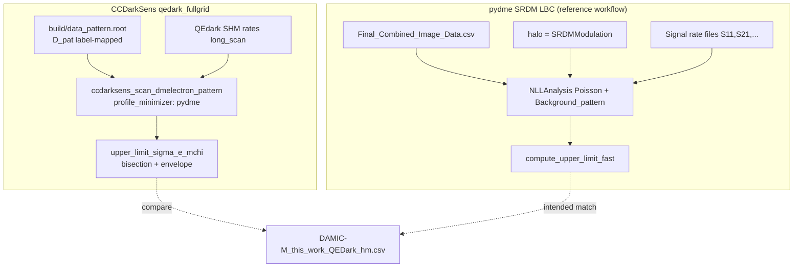

# QEdark pattern UL audit — pydme (SRDM), minimization, contours, reference comparison

**Date:** 2026-06-03 (updated 2026-06-03 — paper export canonical, qhist + halo checks)  
**Config:** [`configs/scan_dmelectron_pattern_data_qedark_fullgrid.json`](../configs/scan_dmelectron_pattern_data_qedark_fullgrid.json)  
**Canonical reference:** paper export `DAMIC-M_2025_QEDark_DMe_heavymediator.txt` in pydme `ScienceRun2024_results-1/` (25 sparse points, loaded by the ScienceRun2024 figure notebook).  
**Legacy / misleading reference:** [`data/previous_limits/heavy_mediator/DAMIC-M_this_work_QEDark_hm.csv`](../data/previous_limits/heavy_mediator/DAMIC-M_this_work_QEDark_hm.csv) — dense 85-point curve, **not** the paper figure file (~3× gap at 2 MeV vs scan).  
**Audit script:** [`utils/audit_qedark_ul_vs_pydme.py`](../utils/audit_qedark_ul_vs_pydme.py)  
**Comparison plot:** [`utils/plot_qedark_all_references.py`](../utils/plot_qedark_all_references.py)

**Related:** [qedark_pattern_data_scan_flow.md](qedark_pattern_data_scan_flow.md), [Log_likelihood_pydme_comparison.md](Log_likelihood_pydme_comparison.md)

---

## 1. pydme case: SRDM, not daily modulation

The pydme workflow we compare against is the **LBC SRDM upper-limit analysis**, not daily modulation.

| Item | Value |
|------|--------|
| Script | [`collab_frameworks/pydme/analysis/SRDM/upper_limit/lbc_dmanalysis_upperlimits.py`](../collab_frameworks/pydme/analysis/SRDM/upper_limit/lbc_dmanalysis_upperlimits.py) |
| Halo | **`halo = 'SRDMModulation'`** (line 42) |
| Not used | `'DailyModulation'` (listed as an option only) |
| Patterns | `INCLUDE_PATTERNS = [11, 21, 111, 31, 22, 211]` |
| Likelihood | Poisson + `Background_pattern` (Bp + θ·Br) |
| UL method | `compute_upper_limit_fast` (2D Migrad → q₀ → bracket + bisection on log₁₀ σ_e) |
| Data | `pydme/data/lbc_datasets/Final_Combined_Image_Data.csv` |

In pydme, `SRDMModulation` selects the signal path in `Signal()` / `Model_pattern()` that uses **precomputed rate tables interpolated in log₁₀(σ_e)** per pattern column (`S11;S21;S111;…` in the rate files passed to `NLLAnalysis`).

**Daily modulation** would use `halo = 'DailyModulation'` and a different time-dependent interpolation — that path is **not** what the DAMIC-M “this work” QEdark heavy reference is tied to in the SRDM script above.

### CCDarkSens vs pydme halo (important distinction)

| | pydme (SRDM script) | CCDarkSens (`qedark_fullgrid`) |
|--|---------------------|--------------------------------|
| Halo in analysis | `SRDMModulation` | N/A (rates precomputed) |
| Rate generation | External SRDM rate columns in pydme signal files | **QEdark** CSVs in `data/qedark_rates/Si/heavy/long_scan` |
| QEdark generator config | — | [`configs/qedark_generate_Si_heavy.json`](../configs/qedark_generate_Si_heavy.json) uses **`halo_type: "SHM"`** (static standard halo: v₀, v_E, v_esc) |

So: we compare **statistics and pattern ROI** to pydme’s **SRDM LBC pattern analysis**, but CCDarkSens signal rates are **SHM QEdark tables**, not pydme’s time-dependent SRDM modulation tables. Any remaining curve shape difference can include this physics input difference, not only likelihood bugs.

---

## 2. Observed data — bug fix (pattern 31 vs 22)

### 2.1 True LBC counts

`build/data_pattern.root` histogram `D_pat` has **11 bins** (all patterns in file). Non-zero bins:

| Pattern | Count |
|---------|-------|
| 11 | 144 |
| 31 | **1** |
| (others) | 0 |

Total: **145** events.

### 2.2 Bug (fixed 2026-06-03)

`load_data_root()` used to read the **first six ROOT bins in file order** and `resize(6)`, without matching labels to `pattern_roi`.

File order: `11, 41, 32, 311, 31, 221, …`  
ROI order: `[11, 21, 111, 31, 22, 211]`

The single event in **pattern 31** was incorrectly assigned to **pattern 22**.

### 2.3 Fix

`load_data_root()` now maps by **x-axis bin label** → `pattern_roi` id (0 if missing).  
Log line: `mapped by pattern label to pattern_roi`.

Correct vector used in fit and written to output `D_pat`:

```
[144, 0, 0, 1, 0, 0]   # patterns 11, 21, 111, 31, 22, 211
```

Code: `apps/ccdarksens_scan_dmelectron_pattern.cc` (`parse_data_bin_label`, `load_data_root`).

---

## 3. Low-mass disagreement (heavy mediator, m ≲ 20 MeV)

**Diagnostic script:** [`utils/diagnose_qedark_low_mass_heavy.py`](../utils/diagnose_qedark_low_mass_heavy.py)  
**Plots:** `outplots/qedark_repro/low_mass_heavy_comparison.pdf`, `low_mass_heavy_ratio_at_ref_masses.pdf`

Compare only for **m ≥ 1.03 MeV** (reference CSV starts at 1.026 MeV). Below that, 117/800 scan points are **pinned to σ_max = 10⁻²⁶** because q(σ) = 0 on the entire grid (`q0 ≈ 0`, no signal turn-on) — not comparable to the reference.

| Mass range | Median scan/ref | Interpretation |
|------------|-----------------|----------------|
| 1–5 MeV | **~0.34** | Scan **~3× more sensitive** (lower σ_e UL) |
| 5–10 MeV | ~0.51 | Converging |
| 10–20 MeV | ~0.70 | Still ~30% low |
| 50–500 MeV | ~1.03 | Good agreement (same as full-grid §4 below) |

**Representative points (interpolated reference):**

| m [MeV] | scan σ_e | ref σ_e | scan/ref |
|---------|----------|---------|----------|
| 1.03 | 2.16×10⁻³³ | 2.31×10⁻³² | 0.09 |
| 2.00 | 1.40×10⁻³⁶ | 4.73×10⁻³⁶ | 0.30 |
| 5.00 | 9.82×10⁻³⁹ | 2.20×10⁻³⁸ | 0.45 |
| 10.00 | 4.65×10⁻³⁹ | 7.73×10⁻³⁹ | 0.60 |
| 100.00 | 1.81×10⁻³⁸ | 1.77×10⁻³⁸ | 1.03 |

**Likelihood check at m ≈ 2 MeV:** q₀ ≈ 0.02, q rises above target_q ≈ 1.64 only for σ ≳ 10⁻³⁶; bisection UL is consistent with stored histogram (not a q-map artifact).

**Signal check (one-point, fullgrid settings):** at m = 1.99987 MeV, σ ≈ 1.08×10⁻³⁶ cm², pattern **11** dominates: S_pat ≈ **13.8** counts (Bp ≈ 141). Scaling σ linearly to the reference UL (4.7×10⁻³⁶) would imply S_pat ≈ **60** in pattern 11 — factor **~3.4×**, matching 1/(scan/ref).

**Constraint variant:** pydme multibin (n=4450) improves mid-mass (~1.02 at 112 MeV) but does **not** fix low mass (m = 2 MeV: UL 1.64×10⁻³⁶ vs tau 1.40×10⁻³⁶; both well below reference 4.7×10⁻³⁶).

**Emin test:** raising `Emin_eV` from 2 → 3.8 eV lowers S_pat(11) only ~12% (13.8 → 12.1) — insufficient to explain the gap.

**Working hypothesis:** the reference used **different pre-folded pattern signal tables** (pydme/Verne `pattern_signal_summed_*` with paolo efficiencies / possibly SRDM-averaged rates), not the current CCDarkSens chain (SHM QEdark `dRdE` + `Efficiencies_patterns_Nsims1000000_DCTrue_alpha1.csv`). Confirm provenance of `DAMIC-M_this_work_QEDark_hm.csv` before changing rates or efficiencies.

**Next actions:**

1. Obtain or regenerate pydme-style **pattern-column** QEdark heavy signal files (S11, S21, …) at low m and compare amplitudes to CCDarkSens `S_pat`.
2. Optional few-mass scan with dense 1–20 MeV grid after signal alignment.
3. Code fix: when bracketing fails with q(σ_max)=0, do not store UL = σ_grid_max (mark invalid / skip point).

---

## 4. Full-grid rerun vs reference (correct data)

After the data fix, full grid was rerun to  
`outputs/scan_pattern_data_qedark_fullgrid/scan_dmelectron_pattern.root`.

| Metric | Value |
|--------|--------|
| Median scan/ref (m ≥ 1 MeV) | **0.83** |
| Median scan/ref (5–1000 MeV) | **0.90** |
| Median scan/ref (80–260 MeV, old “bump”) | **1.05** |
| At 100 MeV | scan 1.81×10⁻³⁸, ref 1.77×10⁻³⁸, ratio **1.03** |
| At 200 MeV | scan 3.56×10⁻³⁸, ref 3.32×10⁻³⁸, ratio **1.07** |

**Interpretation:** With **correct** data, the scan is ~10% **more sensitive** (lower σ_e) than the reference CSV on average. The old **wrong-mapping** run matched the reference (~1.004 median) by accident — not a validation of physics.

Plots: `outplots/qedark_repro/compare_fullgrid_fixed_vs_reference.pdf`, CSV: `outplots/qedark_repro/fullgrid_fixed_ul.csv`.

---

## 5. Bump at ~2×10² MeV (explained)

| Cause | Mechanism | Status after data fix |
|-------|-----------|------------------------|
| **Mis-mapped count** | 1 event in pattern 22 instead of 31 → q₀ jumped between ~1.8 and 0 in 140–213 MeV | **Largely removed** (80–260 MeV median ratio ~1.05) |
| **σ grid ripple** | UL snaps to discrete `logspace(-46,-26,300)` nodes; ratio sawtooth ~±17% vs smooth reference | Still present; finer σ grid reduces it |
| **Envelope smoother** | Post-pass caps local upward spikes in `upper_limit_sigma_e_mchi` | Minor |

Diagnostic: `outplots/qedark_repro/bump_diagnostic.pdf`.

---

## 6. Minimization — CCDarkSens vs pydme (SRDM)

### 5.1 Aligned pieces

| Step | pydme | CCDarkSens (`profile_minimizer: pydme`) |
|------|--------|----------------------------------------|
| Poisson NLL | Σᵢ [μᵢ − nᵢ ln μᵢ] | Same (`ProfileLikelihood::NLL`) |
| Background | Bᵢ = Bpᵢ + θ Brᵢ | Same (`SetBpBr`) |
| Null (q₀) | `xsec_e ≥ 0` → S = 0 in `Model_pattern` | S = 0, profile θ (`nll_null`) |
| Global minimum | 2D minimize (log₁₀ σ, θ) | `MinimizeOverSigmaAndTheta` (Simplex) |
| q_μ | 2(NLL(σ) − NLL_min) | Same |
| target_q | NormQuantile(0.9)² ≈ **1.642** | `TMath::NormQuantile(0.9)²` |
| Upper limit | Bracket + bisection in log₁₀ σ, θ profiled at each probe | Same (`pydme_mode` block in scan) |

pydme null-signal convention (from `Model_pattern`):

```python
if xsec_e >= 0:   # includes fixto('x0', 0.0) for q0
    S = np.zeros(len(INCLUDE_PATTERNS))  # no signal
```

### 5.2 Differences (can explain ~10% vs reference)

| Item | pydme SRDM | CCDarkSens |
|------|------------|------------|
| 2D minimizer | iminuit **Migrad** | ROOT Minuit2 **Simplex** |
| Constraint | Per pattern: sum over **len(γ)** of `−θ·Br/|γ| + 98 ln(θ·Br/|γ|)` | JSON: **`tau_weighted: true`, `n_bins: 1`** (weaker, different shape) |
| pydme `do_single_bin_likelihood` | True: sum model/data over γ per pattern dataset | 6 explicit pattern bins (equivalent if data are already totals per pattern) |
| Signal rates | SRDM-modulated tables | Static **SHM QEdark** CSVs |
| Exposure | pydme `exposure` from Σ N_pix × t_exp × M_pix | Config **3.56×10⁻³ kg·year** (warns vs data file **3.42×10⁻⁵**) |

### 5.3 Constraint variants (few-mass test, correct data)

Compared to reference at representative masses:

| Setting | ~100 MeV scan/ref | Notes |
|---------|-------------------|--------|
| `tau_weighted: true`, `n_bins: 1` (current JSON) | **1.02** | θ not always at boundary; stable NLL |
| `tau_weighted: false`, `n_bins: 4450` | **1.02** (~0.99 at 55 MeV) | Closer at mid-mass; θ → 0.5, huge \|NLL\| — numerically suspect |

**Do not** switch to `n_bins: 4450` without re-deriving a stable pydme-equivalent prior. The old doc recommendation to use multibin for “pydme match” was based on the **wrong-data** run; with **correct** data, tau-weighted is closer to the reference overall.

---

## 7. How the limit contour is drawn

### 6.1 Authoritative curve (scan output)

The scan writes **`upper_limit_sigma_e_mchi`** (TH1D) using **continuous** bracketing + bisection in log₁₀ σ_e (not the coarse σ grid). Values are then passed through a light **envelope** smoother (remove upward local maxima in σ_e).

### 6.2 Plot application

`ccdarksens_plot_dmelectron_limit` **by default** reads `upper_limit_sigma_e_mchi` (or `upper_limit_sigma_e_mchi_graph` if present). It does **not** rebuild the limit from q unless you pass **`--from-qhist`**.

### 6.3 q histogram vs stored UL (do not mix them)

The scan also fills **`q_mchi_sigma_pattern`** on the **300-point σ grid** with **monotonized** q(σ). The plotter’s `--from-qhist` mode crosses q = target_q with **linear interpolation in log σ** between grid points.

At 100 MeV (example):

| Source | σ_e UL [cm²] |
|--------|----------------|
| Stored (bisection) | 1.81×10⁻³⁸ |
| q-map crossing | 1.51×10⁻³⁸ |
| Reference CSV | 1.77×10⁻³⁸ |

Stored UL is **weaker** (higher σ_e) than q-map crossing by ~14% on median (1.2–500 MeV). **Use stored UL** as the primary comparison to the paper export.

| Metric | stored / paper | qhist / paper |
|--------|----------------|---------------|
| Median (1.2–500 MeV) | **1.00** | **0.92** |
| m ≈ 2 MeV | **0.83** | **0.81** |
| Median qhist / stored | — | **0.86** |

The comparison plot [`outplots/qedark_repro/compare_scan_all_references_heavy_qedark.pdf`](../outplots/qedark_repro/compare_scan_all_references_heavy_qedark.pdf) now shows **both** curves (solid = stored, dashed = `--from-qhist`). Use qhist only if the reference was exported from the same discrete q-grid crossing.

```bash
# Correct: use precomputed UL in ROOT
build/ccdarksens_plot_dmelectron_limit \
  outputs/scan_pattern_data_qedark_fullgrid/scan_dmelectron_pattern.root \
  --mediator heavy

# Avoid unless you want the discrete-grid approximation:
# ... --from-qhist
```

---

## 8. Workflow diagram (SRDM pydme vs CCDarkSens)



---

## 9. Reproduction checklist (updated)

1. **Data:** `build/data_pattern.root` with pattern **31** carrying the singleton count; scan must log `pattern 31  D=1`.
2. **Code:** Use build with label-mapped `load_data_root` (2026-06-03 fix).
3. **Constraint:** Keep `tau_weighted: true`, `n_bins: 1` unless you implement a vetted pydme γ-sum prior.
4. **Rates:** QEdark heavy `long_scan`; understand they are **SHM**, not pydme SRDM tables.
5. **Run:** `build/ccdarksens_scan_dmelectron_pattern configs/scan_dmelectron_pattern_data_qedark_fullgrid.json`
6. **Plot:** Use default UL from ROOT (not `--from-qhist`).
7. **Compare:** `python3 utils/audit_qedark_ul_vs_pydme.py` (default ref = paper export) or `python3 utils/plot_qedark_all_references.py`.
8. **Optional:** `--ref-this-work` on audit script for the dense CSV; `--include-this-work` on plot script.

---

## 10. Open items to close gap vs paper export

| Priority | Action |
|----------|--------|
| Done | Adopt **paper export** as canonical reference (plot + audit updated). |
| Done | Overlay **`--from-qhist`** curve on comparison plot (secondary; ~14% more sensitive than stored). |
| Done | **Halo smoke test** at v_E = 253.7 km/s ([`utils/halo_smoke_test_qedark.py`](../utils/halo_smoke_test_qedark.py)); closes ~10% of low-m gap at 2 MeV, not all of it. |
| High | Trace provenance of `DAMIC-M_this_work_QEDark_hm.csv` (why ~3× stronger than paper at 2 MeV). |
| Medium | Low-m residual (stored/paper ≈ 0.61–0.83 for m ≲ 5 MeV): mass-grid sparsity (25 vs 800 pts), signal-generation provenance. |
| Medium | Confirm paper export halo (pydme `MaxwellBoltzmann.py` has v_E = 232 with 263 commented). |
| Low | Finer σ_e grid or interpolate UL to reduce sawtooth vs smooth reference. |

---

## 11. Halo sensitivity (v_E = 253.7 vs 263 km/s)

Script: [`utils/halo_smoke_test_qedark.py`](../utils/halo_smoke_test_qedark.py)

Precomputed QEdark rates use **v₀ = 238, v_E = 263, v_esc = 544 km/s** ([`configs/qedark_generate_Si_heavy.json`](../configs/qedark_generate_Si_heavy.json)). DIM uses **v_E = 253.7 km/s**.

| m_χ [MeV] | R(253.7) / R(263) | Expected UL ratio (253.7 / 263) |
|-----------|-------------------|----------------------------------|
| 1.0 | 0.81 | 1.24 |
| 2.0 | 0.89 | 1.12 |
| 5.0 | 0.94 | 1.06 |

Few-mass scans with scaled rate tables confirm the linear scaling at 1 MeV (UL ratio 1.20). At **2 MeV** (full grid): stored/paper = **0.83** → expected with v_E = 253.7: **~0.93**. Mid/high mass (5–500 MeV): halo shift ≲ 6%, negligible vs median agreement ≈ 1.0.

**Conclusion:** Halo exploration is worth doing but **does not explain** the full 1–5 MeV band offset.

---

## 12. Output files from this audit

| Path | Description |
|------|-------------|
| `outplots/qedark_repro/compare_scan_all_references_heavy_qedark.pdf` | Full grid vs references; **stored + qhist** scan curves |
| `outplots/qedark_repro/compare_scan_all_references_summary.csv` | Median ratios vs paper export (stored and qhist) |
| `outplots/qedark_repro/halo_smoke_test_summary.csv` | Few-mass halo smoke test vs paper export |
| `outplots/qedark_repro/fullgrid_fixed_ul.csv` | m_χ, UL, ref, ratio |
| `outputs/scan_pattern_data_qedark_fullgrid/run.log` | Full scan log |
